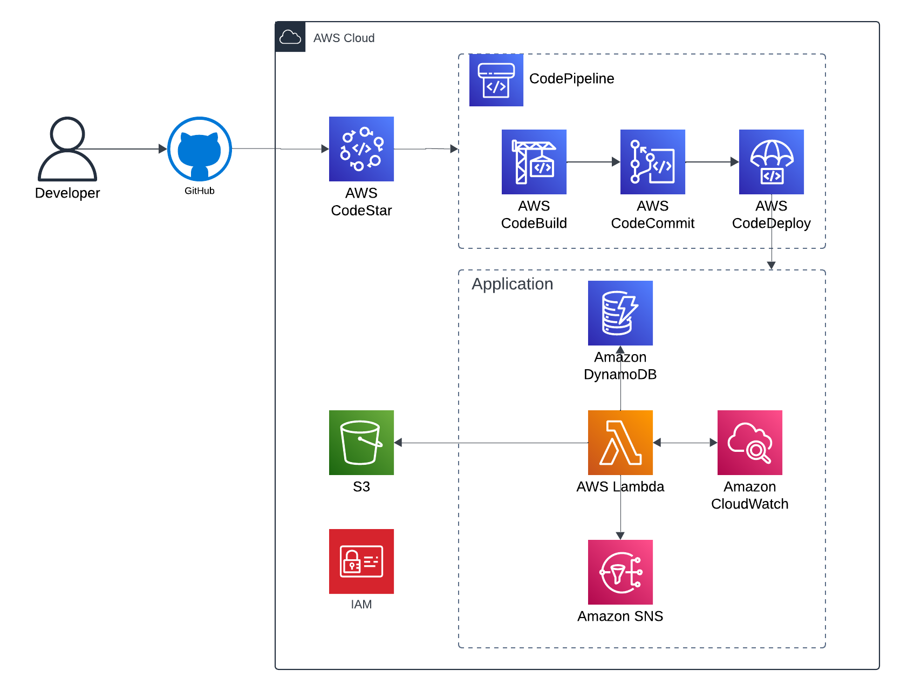

# COMP2029 Canary function
This project defines a CDK stack for application of a Lambda-based application

## DevOps Stack
### **SNS Topic and Email Subscription**
- Create and SNS topic that will send notification when Cloudwatch alarms are triggered.
- Adds an email subscription to this topic, currently notifications are sent to 'kiyohiro.0310@gmail.com'

### **CloudWatch Dashboard**
- Creates a CloudWatch dashboard to display and monitor availability and latency metrics for three websites. Currently, we have the following
  - https://kiyo31.com
  - https://google.com
  - https://youtube.com

### **DynamoDB Table**
- Create a DynamoDB table named with two keys:
  - websiteName (Partition key)
  - timestamp (Sort Key)
Canary Lambda function sends log to dynamoDB table called DevOpsAlarmLog

### **Canary Lambda Function**
- Checks three websites and sends availability and latency to CloudWatch Dashboard
- Send log alarm to user
- Store log to dynamoDB table called DevOpsAlarmLog


## System Architecture


## Prerequisites
To manage and deploy this stac, you will need the following:
- AWS CDK installed ([CDK Installation](https://docs.aws.amazon.com/cdk/latest/guide/getting_started.html))
- AWS CLI configured with your AWS credentials that have permissions to deploy resources
- Node.js (v14 or later)
- CodeStar connection set up to GitHub repository


## Run app
Please make sure you have created repository using aws cdk before pull this repository.
Once you've got repository, take following steps to run app
```
npm install
npm run build
cdk bootstrap (You might need to configure your account)
cdk synth
cdk deploy
```